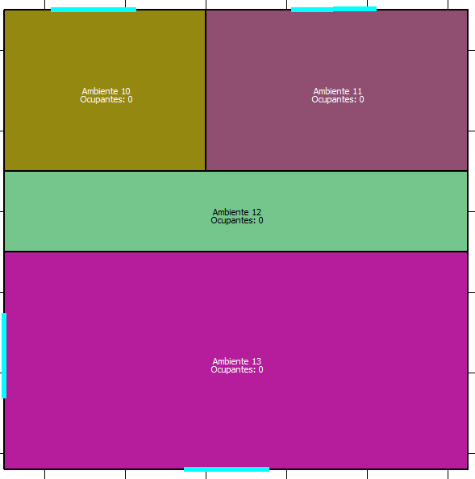
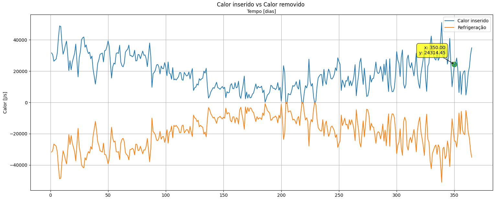
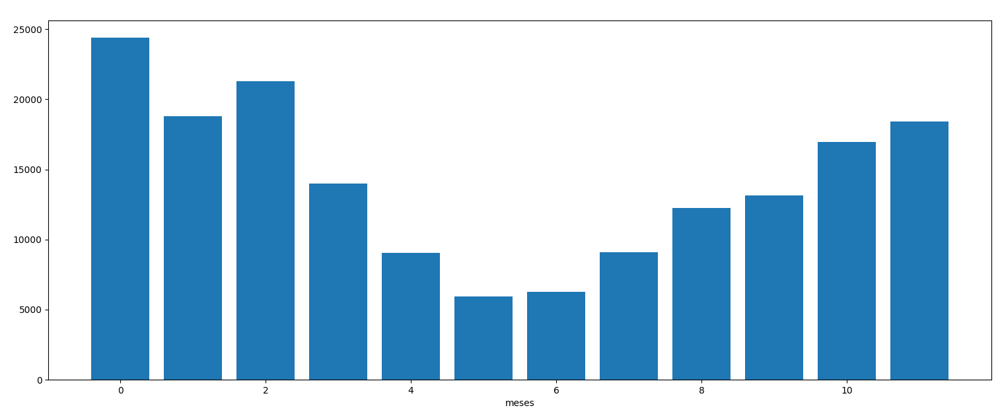
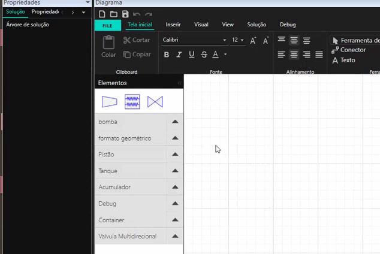
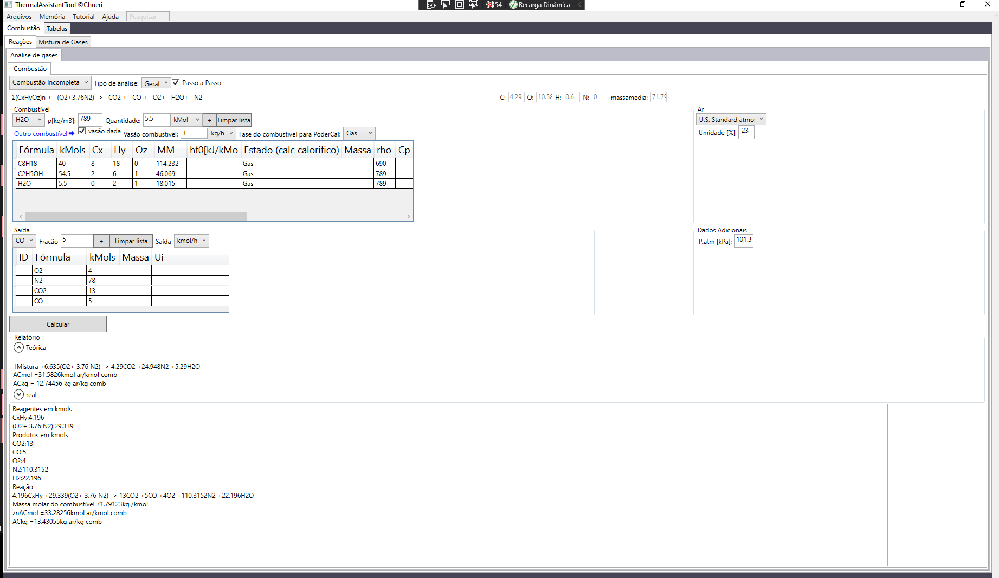

Esta página é um repositório de resumos, softwares e outros projetos realizados por Rodrigo Chueri, estudante de engenharia mecânica na Universidade Federal do Rio de Janeiro.

* * *
### Software de refrigeração RefrigerationStuido

O RefrigerationStudio foi concebido como um Trabalho de Conclusão de Curso e tem como objetivo permitir o rápido dimensionamento de sistemas de refrigeração, tendo uma curva de aprendizado simples sendo possível o aprendizado completo em menos de 1 hora.


[](./imagens/estudo 3 andar 3.png))
[](./imagens/estudo 3 relatorio3.png)
[](./imagens/estudo 3 relatorio4.png)

Versão de 26/05/2024 para download: [Link para download](https://drive.google.com/uc?export=download&id=1kHttX28pU4OBQrn6P5Yy13d3PTSF4Dee).

* * *

### Construtor e simulador de circuitos hidraulicos

O software tem como objetivo permitir o usuário desenhar e simular circuitos hidraulicos complexos com componentes como pistões, válvulas multidirecionas, acumuladores, selenóides, controladores entre muitos outros. 


[](./imagens/simulação_hidro2.gif)

Versão de 11/02/2024 para download: [Link direto para download](https://276b9387-0c36-45a3-9bf9-f95e9c0b0546.filesusr.com/archives/261cc9_02a9534b96f14dee97e51357ec95a877.zip?dn=Release.zip).
*_Ainda se encontra em construção o software
>Pode ser necessário a instalação do Microsoft .Net Framework 5.0 [Link para download](https://dotnet.microsoft.com/en-us/download/dotnet/thank-you/runtime-desktop-5.0.16-windows-x64-installer). 

* * *


### Fluxograma para projeto de vasos de pressão com a ASME VIII div 1

[Link para o diagrama](./asme/diagrama.html). 

* * *

### Simulador de combustão e poluentes

23/03/2023  Versão 0.2.2
[Link direto para download](https://276b9387-0c36-45a3-9bf9-f95e9c0b0546.filesusr.com/archives/261cc9_0096bb8b90ab4329b63177512d54540a.zip?dn=Thermal%20Calculator.zip). 
>Pode ser necessário a instalação do Microsoft .Net Framework 5.0 [Link para download](https://dotnet.microsoft.com/en-us/download/dotnet/thank-you/runtime-desktop-5.0.16-windows-x64-installer)


*obs.: existe um erro onde mesmo que seja zero o programa fechará caso não entre com os 4 gases disponíveis de saída. Então no caso onde por exemplo há uma saída de 78% de composição molar de N2, 2% de O2, 0% de CO e 20% de CO2 na saída ainda se faz necessário entrar com 0% de CO na tabela. Próxima versão isso será corrigido.

[](./imagens/combustão1.png)

* * *

### Breve guia de sistemas de controle
[Link para o artigo]( https://www.academia.edu/74098782/Um_breve_resumo_em_Sistemas_de_Controle). *acompanha algumas linhas de código em Maple

***

### Calculadora de reações em barras
23/03/2022 Versão 1.0  [Link direto para download](https://276b9387-0c36-45a3-9bf9-f95e9c0b0546.filesusr.com/archives/261cc9_0096bb8b90ab4329b63177512d54540a.zip?dn=Thermal%20Calculator.zip).
>Pode ser necessário a instalação do Microsoft .Net Framework 5.0 [Link para download](https://dotnet.microsoft.com/en-us/download/dotnet/thank-you/runtime-desktop-5.0.16-windows-x64-installer)


<!-- 
### Header 3

```js
// Javascript code with syntax highlighting.
var fun = function lang(l) {
  dateformat.i18n = require('./lang/' + l)
  return true;
}
```

```ruby
# Ruby code with syntax highlighting
GitHubPages::Dependencies.gems.each do |gem, version|
  s.add_dependency(gem, "= #{version}")
end
``` -->


<!-- 
###### Header 6

| head1        | head two          | three |
|:-------------|:------------------|:------|
| ok           | good swedish fish | nice  |
| out of stock | good and plenty   | nice  |
| ok           | good `oreos`      | hmm   |
| ok           | good `zoute` drop | yumm  |
 -->


